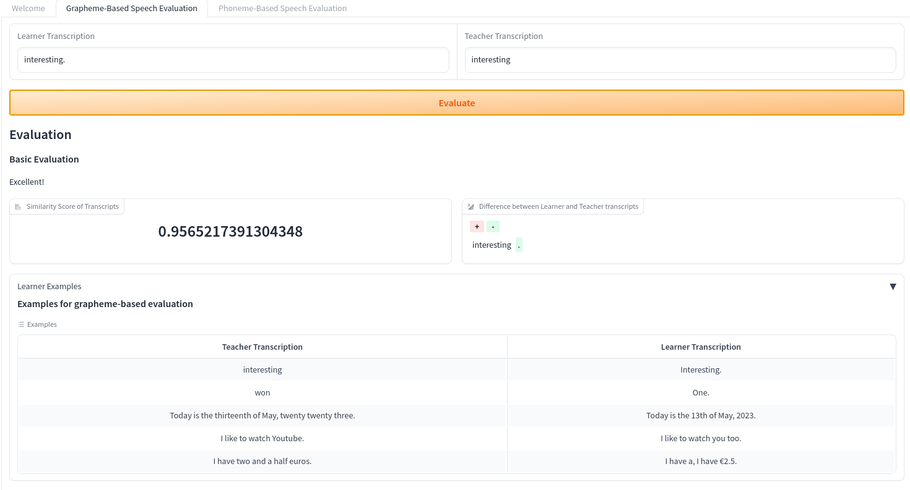

# Basic Grapheme-Based Solution



## Approach

In this simple solution we load the grapheme transcription of the learner recording, as well as the ground-truth transcription and compute
a similarity ratio, as well as a diff between the graphemes. Further, based on the similarity score simple feedback is generated to inform the learner about their performance.

Before comparing the graphemes, we use a very simple normalization procedure.

```python
def normalize_texts(actual: str, expected: str) -> list[str]:
    """Normalize two input texts by converting them to lower case and stripping whitespace.

    Note: This normalization function is very simple and only here to demonstrate the general necessity of normalization
    """

    return [text.lower().strip() for text in [actual, expected]]
```

The similarity score and diff are produced with the `difflib.SequenceMatcher`/`difflib.Differ`:

```python
def compare_phrases(expected: str, actual: str) -> float:
    """Calculate the similarity ratio between two phrases."""
    return SequenceMatcher(None, expected, actual).ratio()


def diff_phrases(expected: str, actual: str) -> list[Tuple[str, Optional[str]]]:
    """Generate a diff between two phrases."""
    differ = Differ()
    return [
        (token[2:], None if token[0] == " " else token[0])
        for token in differ.compare(expected, actual)
    ]
```

and then a simple rule-based approach yields the feedback:

```python
def generate_feedback(similarity_ratio: float) -> str:
    """Generate feedback based on the similarity ratio."""
    if similarity_ratio > 0.9:
        return "Excellent!"
    elif similarity_ratio > 0.7:
        return "Good job!"
    elif similarity_ratio > 0.5:
        return "Not bad, but there's room for improvement."
    else:
        return "Please try again, focus on pronunciation and clarity."
```

The whole grapheme-based evaluation is as simple as:


```python
def basic_evaluation(
    expected: str, actual: str, autojunk: bool = True
) -> Tuple[float, str, list[Tuple[str, Optional[str]]]]:
    """Evaluate speaking attempts by comparing expected and actual phrases."""
    expected, actual = normalize_texts(expected, actual)
    similarity_ratio = compare_phrases(expected, actual)
    diff = diff_phrases(expected, actual)
    feedback = generate_feedback(similarity_ratio)
    return similarity_ratio, feedback, diff
```

#### About the `SequenceMatcher`
Note: Visit [https://docs.python.org/3/library/difflib.html](https://docs.python.org/3/library/difflib.html) for more details.

**Information**: The `SequenceMatcher` is a flexible class for comparing pairs of sequences of any type, so long as the sequence elements are hashable. The basic algorithm predates, and is a little fancier than, an algorithm published in the late 1980’s by Ratcliff and Obershelp under the hyperbolic name “gestalt pattern matching.” The idea is to find the longest contiguous matching subsequence that contains no “junk” elements; these “junk” elements are ones that are uninteresting in some sense, such as blank lines or whitespace. (Handling junk is an extension to the Ratcliff and Obershelp algorithm.) The same idea is then applied recursively to the pieces of the sequences to the left and to the right of the matching subsequence. This does not yield minimal edit sequences, but does tend to yield matches that “look right” to people.

**Timing**: The basic Ratcliff-Obershelp algorithm is cubic time in the worst case and quadratic time in the expected case. SequenceMatcher is quadratic time for the worst case and has expected-case behavior dependent in a complicated way on how many elements the sequences have in common; best case time is linear.

**Automatic junk heuristic**: SequenceMatcher supports a heuristic that automatically treats certain sequence items as junk. The heuristic counts how many times each individual item appears in the sequence. If an item’s duplicates (after the first one) account for more than 1% of the sequence and the sequence is at least 200 items long, this item is marked as “popular” and is treated as junk for the purpose of sequence matching. This heuristic can be turned off by setting the autojunk argument to False when creating the SequenceMatcher.

## Limitations of Grapheme-Based Approach

### Analysis of Transcription Pairs

#### Pair 1: "Interesting."
- **Teacher Transcription:** "interesting."
- **Learner Transcription:** "Interesting."

**Analysis:** 
- The learner's transcription starts with a capital "I" and ends with a period. This could be remedied by using a simple normalization function. 
- The capitalization and punctuation are transcription errors but do not necessarily indicate a pronunciation error. This highlights a limitation in assessing pronunciation purely from written transcriptions without audio context.
- Further, without audio, it's impossible to assess prosodic aspects like stress, intonation, or subtle phonetic variations (e.g., the reduction of unstressed vowels or the precise articulation of consonants).

#### Pair 2: "won" vs. "One."
- **Teacher Transcription:** "won"
- **Learner Transcription:** "One."

**Analysis:** 
- This is an example where grapheme-based transcription fails to capture the intended meaning, as it cannot differentiate homophones based solely on sounds
(The words "won" and "one" are homophones in English, pronounced the same way but differing in meaning and spelling)

#### Pair 3: "Today is the thirteenth of May, twenty twenty-three." vs. "Today is the 13th of May, 2023."
- **Teacher Transcription:** "Today is the thirteenth of May, twenty twenty-three."
- **Learner Transcription:** "Today is the 13th of May, 2023."

**Analysis:** :
- While there is no indication of pronunciation errors (both transcriptions likely sound identical), the discrepancy lies in the representation of dates and numbers due to the transcription
- This again demonstrates that grapheme-based approaches are affected by transcription errors/differences.

#### Pair 5: "I have two and a half euros." vs. "I have, I have €2.5."
- **Teacher Transcription:** "I have two and a half euros."
- **Learner Transcription:** "I have, I have €2.5."

**Analysis:** 
- The disfluency in the learner's transcription ("I have, I have") could be striped by preprocessing before the evaluation to ensure a better comparison
- The discrepancy between "€2.5" instead of "two and a half euros" again demonstrates grapheme-based transcription problems

### Limitations of a Grapheme-Based Approach

A grapheme-based approach primarily focuses on the written symbols of a language (letters and numbers) and their standard pronunciations. However, this approach has several limitations. For example:

1. **Homophones and Homographs:** Words like "won" and "one" illustrate how identical pronunciations can lead to a bad evaluation score when solely relying on graphemes. Similarly, words spelled the same but pronounced differently (read (present) /read (past)) could lead to perfect grapheme scores, although the pronunciation was off.

2. **Suprasegmental Features:** Elements such as stress, rhythm, intonation, and pitch are crucial in spoken language but are not captured by graphemes. For example, the word "interesting" in the learner audio was pronounced with wrong stress patterns.

### Remedy through Phoneme-based Approach 

To address the limitations, as well as in order to provide a more personalized and constructive feedback, we create a more advanced [phoneme-based solution](phoneme_based_solution.md)
