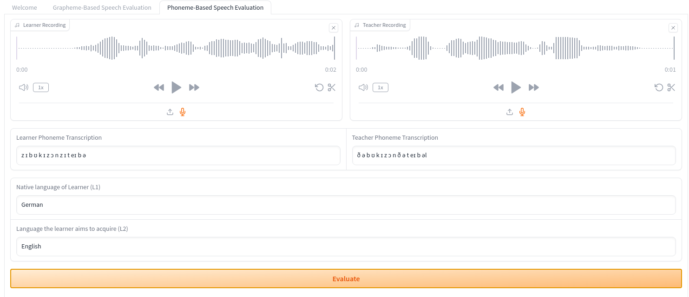
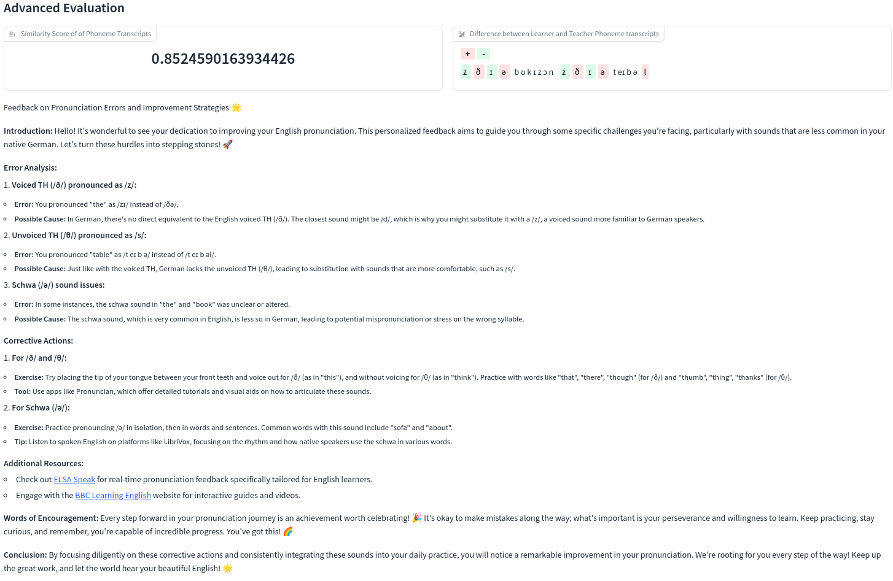
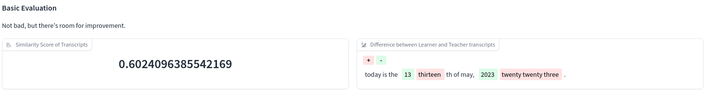
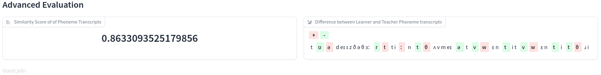

# Phoneme-based Pronunciation Trainer

## Interface


## Feedback Example


## Approach

### Create teacher/ground truth audio files

We start by creating teacher audio files using OpenAi's Text-To-Speech API

```python
def produce_teacher_audio(audio_name, text):
    """
    Produce a teacher audio file for the given text using OpenAI's Text-to-Speech API.
    See: https://platform.openai.com/docs/guides/text-to-speech
    """

    speech_file_path = Path(f"audios/teacher/{audio_name}")
    response = client.audio.speech.create(
        model="tts-1-hd",
        voice="alloy",
        input=text,
    )

    response.stream_to_file(speech_file_path)
    log.info(
        f"Successfully produced teacher audio for {text=} at {speech_file_path.name=} 🎉"
    )


if __name__ == "__main__":
    # Produce teacher/ground-truth audio files for the given examples
    data = load_data()
    for datum in data:
        produce_teacher_audio(datum["learner_recording"], datum["text_to_record"])

    # Produce an additional example
    produce_teacher_audio("book.wav", "The book is on the table")
```


### Audio-based and Personalized Input

Given the newly created teacher audios, we can now use both learner and teacher audios as input to our system
and thereby avoid the transcription-based limitations that we described in the [grapheme-based solution](grapheme_based_solution.md).

As you can see in the following image, we also supply the native language of the learner and the language they want to acquire.


### Phoneme-Based ASR

We use a [Wav2Vec2Phoneme](https://huggingface.co/docs/transformers/model_doc/wav2vec2_phoneme) model as proposed in  [Simple and Effective Zero-shot Cross-lingual Phoneme Recognition](https://arxiv.org/abs/2109.11680)

> Recent progress in self-training, self-supervised pretraining and unsupervised learning enabled well performing speech recognition systems without any labeled data. However, in many cases there is labeled data available for related languages which is not utilized by these methods. This paper extends previous work on zero-shot cross-lingual transfer learning by fine-tuning a multilingually pretrained wav2vec 2.0 model to transcribe unseen languages. This is done by mapping phonemes of the training languages to the target language using articulatory features. Experiments show that this simple method significantly outperforms prior work which introduced task-specific architectures and used only part of a monolingually pretrained model.


In particular, we use the following checkpoint: [facebook/wav2vec2-lv-60-espeak-cv-ft · Hugging Face](https://huggingface.co/facebook/wav2vec2-lv-60-espeak-cv-ft). 
> This checkpoint leverages the pretrained checkpoint wav2vec2-large-lv60 and is fine-tuned on CommonVoice to recognize phonetic labels in multiple languages.

For convenience, we create a partial `transcribe_to_phonemes` function as interface to this checkpoint:

```python
class TranscriberChoice(StrEnum):
    grapheme = "openai/whisper-base.en"
    phoneme = "facebook/wav2vec2-lv-60-espeak-cv-ft"


def transcribe(
    audio, transcriber_choice: TranscriberChoice = TranscriberChoice.grapheme
):
    """
    The transcribe function takes a single parameter, audio, which is a numpy array of the audio the user recorded.
    The pipeline object expects this in float32 format,so we convert it first to float32, and then extract the transcribed text.
    """
    transcriber = pipeline("automatic-speech-recognition", model=transcriber_choice)
    try:
        sr, y = audio
        print(f"Sampling rate is {sr}")
    except TypeError:
        return None
    y = y.astype(np.float32)
    y /= np.max(np.abs(y))
    transcription = transcriber({"sampling_rate": sr, "raw": y})["text"]
    return transcription


transcribe_to_phonemes = partial(
    transcribe, transcriber_choice=TranscriberChoice.phoneme
)
transcribe_to_graphemes = partial(
    transcribe, transcriber_choice=TranscriberChoice.grapheme
)
```
### Simple Evaluation based on `SequenceMatcher`

We can again apply the `SequenceMatcher`, but this time compare the phoneme transcriptions of teacher and learner audio.

As illustrated here for the date example, we get a much better similarity score:

#### Grapheme-based


#### Phoneme-based


But, the feedback message is still not very helpful.


### Advanced Evaluation based on LLM

Much more powerful, however, is an evaluation leveraging the power of an LLM (`GPT-4-turbo`).


We create a simple LLM chain

```python
prompt = ChatPromptTemplate.from_template(Path("prompt.md").read_text())
output_parser = StrOutputParser()


def create_llm(openai_api_key=openai_api_key):
    if openai_api_key in [None, ""]:
        raise gr.Error(
            "No API key provided! You can find your API key at https://platform.openai.com/account/api-keys."
        )
    llm = ChatOpenAI(model="gpt-4-turbo", openai_api_key=openai_api_key)
    return llm


def create_llm_chain(prompt=prompt, output_parser=output_parser, openai_api_key=openai_api_key):
    if openai_api_key in [None, ""]:
        raise gr.Error(
            """No API key provided! You can find your API key at https://platform.openai.com/account/api-keys."""
        )
    llm = ChatOpenAI(model="gpt-4-turbo", openai_api_key=openai_api_key)
    llm_chain = prompt | llm | output_parser
    return llm_chain
```

and ingest the following inputs:

```python
def advanced_evaluation(
    learner_l1,
    learner_l2,
    learner_phoneme_transcription,
    teacher_phoneme_transcription,
) -> str:
    """Provide LLM-based feedback"""
    return create_llm_chain().invoke(
        {
            "learner_l1": learner_l1,
            "learner_l2": learner_l2,
            "learner_phoneme_transcription": learner_phoneme_transcription,
            "teacher_phoneme_transcription": teacher_phoneme_transcription,
        }
    )
```      

into an LLM prompt template that can be found here:  
[Enhanced Prompt Template for Language Model Expert with Motivational Elements and Language-Specific Feedback](prompt.md).


## Limitations & Outlook


### Improve ASR Model

Due to time constraints, I selected the first phoneme recognition model that I found on Hugging Face.
With more time, one could 
- Experiment with different checkpoints at [Phoneme Recognition Models - Hugging Face](https://huggingface.co/models?other=phoneme-recognition)
- Adapt OpenAI's Whisper model on phoneme recognition/transcription by simply changing the tokenizer to handle the new vocabulary (the set of phonemes), 
and fine-tuning th model on an (audio, phoneme) dataset with an appropriate metric. See [openai/whisper · Phoneme recognition](https://huggingface.co/spaces/openai/whisper/discussions/86) for a short discussion about it.
- Employ a model like [m-bain/whisperX: WhisperX](https://github.com/m-bain/whisperX) and possibly fine-tune it, to achieve word-level timestamps & diarization. 

Further, the output of the ASR model could be enhanced by grouping phonemes (to allow for better world-level feedback and alignment) and also adding better prosodic/suprasegmental support.


### Improve LLM prompt

Again due to time constraints, I created a single prompt template. 
Further prompt engineering and metaprompting could 
- Reduce hallucinations 
- Create a more didactically sound feedback, e.g. divided in different feedback sections like 
    - Place. The place of articulation is where a sound is made.
    - Manner. The manner of articulation is how a sound is made.
    - Voicing. Voice or voicing refers to the vibration of the vocal folds.
- Recommend fitting exercises and content of babbel.com

#### Improve UI/feedback time

The LLM response currently takes some time. Among many ways to tackle this problem, one could:
- Stream the response for immediate feedback and better UX 
- Use clever caching for immediate responses
- Collect several attempts, and only provide the LLM feedback on an aggregate of attempts (for example in a dedicated pronounciation trainer section)


### Personalization

The personalization is very limited as it only looks as l1 and l2 of the learner.
We could further:

- Compare the current attempt with previous attempts in order to show progress/regress. This could be especially motivating if learner is still far from a perfect pronunciation, but steadily improves.
- Include additional learner information, like preferences and proficiency, etc.

### Alternative phoneme-based feedback
- Instead of, or complimentary, to employing an LLM for advanced and personalized feedback, we could provide scores and feedback based on a distance measure between phonemes.
    - Among a variety of possible distances, a simple starting point could be a 3-D distance of the place of articulation (where the sound is made).  
